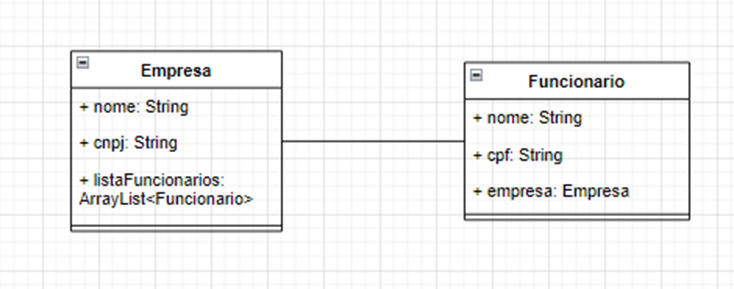

# API de Empresa
  

Este projeto é uma API que foi baseado no diagrama de classes, abaixo, utilizando JAVA, Java Spring, com documenção Swagger, conforme solicitado nos exercícios do Curso TI 360 TECH - Formação de Profissional 4.0, do Weslley Borges - Executivo de TI, para obter maior conhecimento na linguagem.

## Responsabilidades da API
- Retornar uma lista de todas as empresas cadastradas,
- Retornar uma empresa cadastrada, filtrando por código, retornando "OK - Tarefa Encontrada", "ERRO - Tarefa não localizada" ou "Erro Inesperado,
- Cadastrar novas empresas.
- Deletar uma empresa.

## Ferramenta utilizada para realização de testes
Para verificar se o código estava funcionando corretamente foi utilizada a Ferramenta POSTMAN, apresentando a mensagem abaixo relacionado no Body do cadastro:

{
    
    "id": 1,
    "Nome da Empresa": "Teste",
    "CNPJ": "Teste",
    "Funcionarios": "Teste"    
}